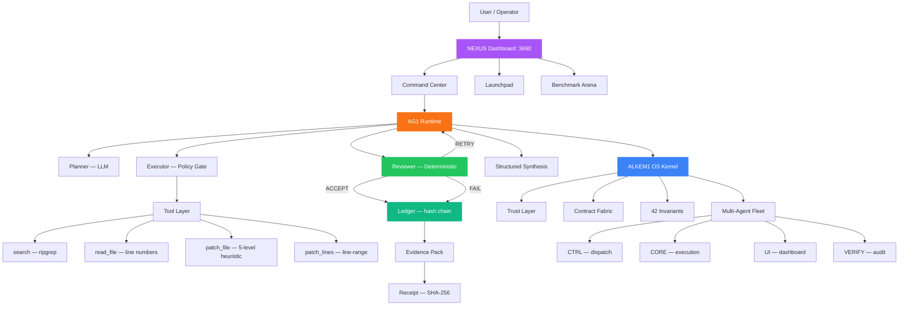

<h1 align="center">Aleksandar Stefanović</h1>
<h3 align="center">Founder — ALKEM1 · Constitutional AI Systems</h3>

  <em>Building verified, offline-first AI operating systems that prove what they did.</em>

  
  
  
  
  

---

### AG1 — Constitutional Agent Runtime

An AI agent that doesn't just execute code — it *proves* it did it safely.

- **Bounded execution loop** — deterministic reviewer, no LLM in the judge
- **Structured patch synthesis** — focused JSON contracts for surgical code edits
- **5-level heuristic matching** — exact → normalized → fuzzy → indent-flexible → block-anchor
- **Cryptographic evidence chain** — hash-chained ledger, receipts, evidence packs
- **Cognitive self-correction** — retry with LLM replanning when reviewer says RETRY
- **4-runner benchmark arena** — AG1 vs Aider vs OpenCode vs Claude Code

### ALKEM1 OS — Kernel-First Operating Layer

288K LOC, 42 invariants, zero-trust architecture.

- **5-layer kernel** — crypto → trust → map → runtime → apps
- **Multi-agent orchestration** — 4-lane dispatch with fencing tokens
- **NEXUS Dashboard** — 70+ pages, fullscreen launchpad, 3 themes
- **Blockchain anchor** — Polygon Amoy proof chain

---

### Architecture

---

### Stack

  
  
  
  
  
  
  
  

---

### Benchmark — Operational Proof

> Same model (qwen2.5-coder:14b). Same tasks. Same workspace. Different runtimes.

| Metric | 🛡️ AG1 | Aider | OpenCode | Claude |
|--------|---------|-------|----------|--------|
| Capability | 67% | 100% | 100% | 67% |
| Safety | **100%** | 87% | 100% | 100% |
| Governance | **100%** | 0% | 0% | 0% |
| Containment | **100%** | 100% | 100% | 0% |
| **Overall** | **81** | 70 | 60 | 43 |

AG1 wins because it's the only system that **proves** what it did.

Every other system is faster. None of them can show you a receipt.

---

### Repos

| Project | Description | Status |
|---------|-------------|--------|
| [`alkem1-ag1`](https://github.com/alkem1-lab/alkem1-ag1) | Constitutional agent runtime |  |
| [`alkem1_os`](https://github.com/alkem1-lab/alkem1_os) | Kernel-first OS — 288K LOC |  |
| [`alkem1-xck`](https://github.com/alkem1-lab/alkem1-xck) | Security toolkit |  |
| [`alkem1-trading`](https://github.com/alkem1-lab/alkem1-trading) | Autonomous trading system |  |

---

  <a href="mailto:alek@alkem1.com">alek@alkem1.com</a> · 
  <a href="https://www.instagram.com/alkem1ag1/">Instagram</a> · 
  <a href="https://www.behance.net/stefanovicaleksandar">Behance</a> ·
  Geneva, Switzerland

  
  

  

